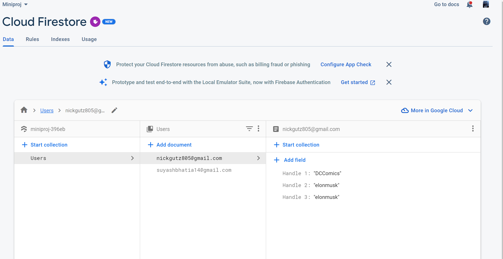

# Gutierrez_Bhatia_SWMiniproject
Nicholas Gutierrez and Suyash Bhatia EC463 SW MiniProject 
## How To Use TwitterBotSentimentDetector
Note: Instructions are for an android emulator in android studio, the app can be pushed to a real android device, but those instruction can be found on the react-native website.
### Setup
#### Step 1:
Open 5 command terminals, index the first two into the TwitterBotSentimentDetector folder and the other three into the PythonFlaskAPI folder.
Hereafter referred to as T1,T2,T3,T4,T5.

#### Step 2:
Run these commands in these terminals in order:

T1: 
    
    npx react-native start

T3: 

    python TwitterUserCheck.py

T4: 

    python Botometer.py

T5: 

    python GoogleNlpApi.py

Any Debug information can be viewed in their corresponding terminals
#### Step 3:
Open your android emulator and run this command in T2.
    
    npx react-native run-android

### Use
Note: See video for full example
#### Step 1:
Click the login button and sign in to your Google account.

Note: The is a screen responsiveness test button to check if the emulator is running properly. If the button changes color, or the ButtonPress text goes from "Unpressed" to "Pressed" then everything is working.

#### Step 2:
Pick a Twitter handle

#### Step 3:
Enter the handle in the text block (make sure to exclude the '@')

#### Step 4:
Press enter on the keyboard and watch how the data flows in.

#### Step 5:
Enter a new handle, clear the data, or sign out and add a new user.

### Data Fields
Note: Some data like the sentiment analysis make take a minute or two to be fully displayed on the app screen

UserExists - Displays "Exists", "Does Not Exist", or "Not Authorized" depending on the status of the handle.

Botscore - Percentage that the handle is a Twitter Bot (see API explanation for details)

Handle/Follower: Submitted Handle or Handle of Submitted Handle's Follower

Score: Sentiment Score

Magnitude: Sentiment Magnitude

### Flow of Information

Here is how the proper data is collected after the user signs into google and submits a handle

#### Step 1: Handle Verification
Handle is passed to the TwitterUserCheck API to verify the handle exists. If it does, then the information is passed to the next step. If it doesn't exist, then the user is alerted.
This also sets the UserExists data field

#### Step 2: Read
The handle and user email is passed to the Google Firestore Database Read function which checks if a document has already been created for the email (meaning the user has used the app before), and all currently stored handles for the corresponding user.

#### Step 3: Write
The handle and whether the user document exists is passed to the Firestore Write function, which either creates a new document and writes the handle or appends the handle to the preexisting handle.
All handles are stored as Handle {amount of handles already in database+1}: {submitted handle}.

##### Firestore database structure:

### Step 4: Botometer

If every previous step has succeeded, then the submitted handle is first passed to the Botometer Api which determines the botscore data field

### Step 5: Sentiment Analysis

If Botometer succeeds, the handle is passed to the Google NLP sentiment analysis Api which determines the submitted handle's and three followers sentiment score and magnitude.

### Sources:
    https://rnfirebase.io/firestore/usage
    https://reactnative.dev/docs/environment-setup
    https://reactnavigation.org/docs/hello-react-navigation
    https://www.geeksforgeeks.org/how-to-connect-reactjs-with-flask-api/
## APIs Used

### Twitter API
We used the Twitter API v1 3.10.0 to access all data needed from twitter.
Using a developer account, we got access to Twitter APIs. We exercised these 
APIs in order to check various things about a user as well as access information 
about the user.

Specifically, we used Twitter API to check if a user exists/validity of user. 
Following that we accessed the "following" of a user. From the users list of followers
we randomly selected 5 users and accessed their newest tweet.

##### Resources:
    Geeksforgeeks
    Tweepy Documentation
    Twitter API V1 Documentation
### Botometer API
We used the Botometer API to check if the specific username entered by the user
is a bot or not. If the score, ranging from 0 to 1 is on the lower side then
it is less likely that the user is a bot. If the score is on the higher side then there
is a high probability that the user is a bot.

Now, lets dive into the functioning of the botometer. The botometer requires information from the 
Twitter API in order to analyse bot like activity of a user. For the botometer 
to access information from twitter we need to provide twitter authentication keys 
as headers to the botometer.

##### Resources: 
        https://botometer.osome.iu.edu/
        https://rapidapi.com/OSoMe/api/botometer-pro
        https://github.com/IUNetSci/botometer-python
### Google Natural Language API
Exercising the Google natural API was very straight forward. Google instead has a very painstaking 
way of authenticating a user, especially when running locally. To authenticate the API calls we 
installed google CLI on our local machine. This helped in providing local authentication for the NLP to 
be exercised. 

Once the user was authenticated and some additional set up was complete,
it was pretty straightforward for us to exercise the NLP. We chose to use the magnitude and
score as our two metrics of analysis. The meaning of the two metrics used:
    
The Score of the sentiment ranges between -1.0 (negative) and 1.0 (positive) and corresponds 
    to the overall sentiment from the given information.

The Magnitude of the sentiment ranges from 0.0 to +infinity and indicates the overall 
    strength of sentiment from the given information. The more information that is provided the higher the magnitude.
##### Resources:
    https://codelabs.developers.google.com/codelabs/cloud-natural-language-python3#6

### List of Libraries needed to be installed
    !pip3 install --user --upgrade google-cloud-language
    !pip install --upgrade google-api-python-client google-auth-httplib2 google-auth-oauthlib
    !pip install tweepy --upgrade
    !pip install tweepy==3.10.0
    !pip install --upgrade google-cloud-language==2.4.3
    !pip install requests
    !pip install botometer

## Demo Video
https://drive.google.com/file/d/1EvzvRrrK-hOJWmr3nquFgOlVvQD9J0Tk/view?usp=drivesdk

